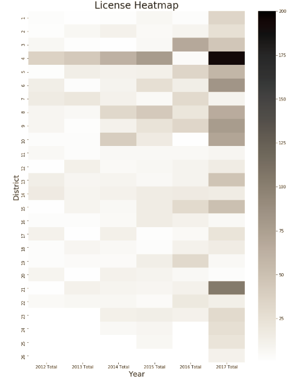
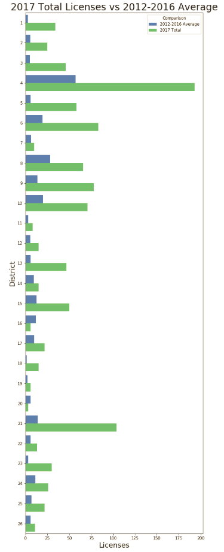

# Python for Data Project

## Question
After reviewing Louisville Metro open data portal, I became curious about which Louisville Metro districts had the largest growth in liquor license issuances in recent years.

## Special requirements, dependencies, or steps

The following utilities/libraries are required, which are all standard in an Anaconda install.

-Jupyter Notebooks
-CSV
-Sqlite3
-Pandas
-Numpy
-Seaborn
-Matplotlib

## Overview

Data was obtained in CSV format via the Louisville Metro data portal (https://data.louisvilleky.gov/). The data was read into an sqlite3 database and was scrubbed. The district and 2012 - 2017 issuances were loaded into a dataframe and a 2012 - 2016 average per district was calculated, along with the percentage increase in 2017 issuances over the average. 

The following is a map of the 26 Louisville Metro districts:

An interactive district map can be found at the following link: https://louisvilleky.gov/government/metro-council/district-maps.

The data was then visualized in three distinct ways. First a heatmap was created of number of issuances by district for 2012 through 2017. This allowed for a visual analysis of the general trends in the data, which were harder to determine in table form alone. For instance, 2017 issuances were significantly higher than prior years across the majority of districts, and issuances in District 4 were among the highest for each year.  

The second visualization was a barchart comparing 2017 issuances to the 2012 - 2016 average. This allowed for a quick comparison for each district. 

Finally, the top and bottom 5 districts by 2017 percentage increase vs 2012 - 2016 average were presented. This is the high level presentation of the date which would be suitable to convey the quick takeaways from this data analysis. 

## Conclusion
As shown in the heatmap, 2017 issuances increased significantly over prior years. As shown in the comparison of 2017 to the average, District 4 had the highest total increase in issuances, while District 16 had the highest total decrease in issuances vs the average. Finally, the top and bottom 5 chart reveals that District 1 had the highest increase in issuances, up nearly 1,200% in 2017 over the 2012 - 2016 average, while District 20 had the largest decrease at 50%.

